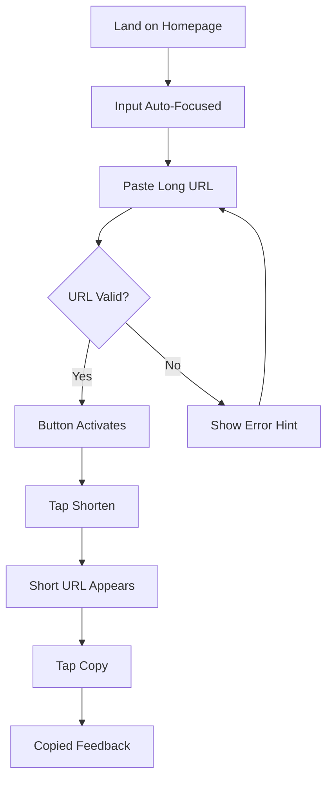
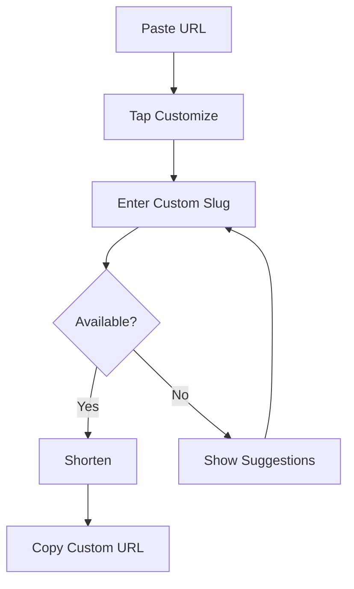
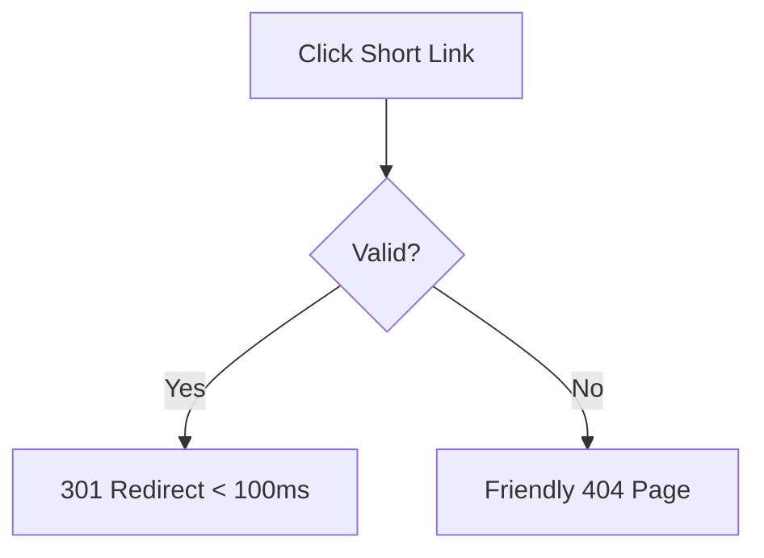

# UX Design Specification tiny-url

**Author:** Stas
**Date:** 2026-01-24

---

## Executive Summary

### Project Vision

tiny-url delivers a frictionless URL shortening experience built around the core principle: **"Paste → Click → Copy → Done."** The UX must feel instant, invisible, and effortless — users should think "That was easy" and move on with their day.

### Target Users

**Primary Users:**
- **Casual Sharers (Alex)** — Impatient, task-focused users who need speed above all else. They want to paste a URL, get a short link, and leave in under 10 seconds.
- **Content Creators (Maya)** — Brand-conscious users who value custom, memorable slugs. They're willing to spend an extra moment to get the perfect link.

**Secondary Users:**
- **Link Recipients (Jordan)** — Passive users who click short links. Their experience is defined by what they DON'T notice — the redirect should be invisible.

### Key Design Challenges

1. **Balancing Simplicity vs. Power** — Surface custom slug options without adding friction for users who don't need them
2. **Error States as Opportunities** — Transform "slug taken" errors into helpful, guiding moments
3. **Invisible Performance** — Redirects must be so fast users don't perceive them
4. **Mobile-First Interaction** — The entire flow must work flawlessly with one thumb on a phone

### Design Opportunities

1. **One-Handed Mobile UX** — Optimize for thumb-reachable tap targets and swipe gestures
2. **Progressive Disclosure** — Show advanced options (custom slugs) only when users want them
3. **Instant Gratification** — Provide immediate visual feedback at every step
4. **Micro-Celebrations** — Subtle, satisfying animations that make copying feel rewarding

## Core User Experience

### Defining Experience

**Core Action:** Transform a long URL into a short one in under 10 seconds.

**The Flow:** Paste → Click → Copy → Done

This is the atomic unit of value. Every design decision must protect and optimize this flow. If a feature adds friction to this core loop, it doesn't belong in MVP.

### Platform Strategy

| Aspect | Decision | Rationale |
|--------|----------|-----------|
| **Primary Platform** | Mobile Web (SPA) | Most link sharing originates on mobile devices |
| **Interaction Model** | Touch-first | Optimize for thumb taps, swipes; mouse/keyboard as enhancement |
| **Responsive Approach** | Mobile-first | Design for 375px width, progressively enhance for tablet/desktop |
| **Offline Support** | Not required | URL shortening inherently requires network connectivity |
| **Browser Support** | Modern only | Chrome, Firefox, Safari, Edge (last 2 versions) |

### Effortless Interactions

**Zero-Friction Moments:**

1. **Smart Paste** — Input field auto-focuses on page load; pasted URLs are instantly validated
2. **One-Tap Shorten** — Default path requires exactly one button tap after paste
3. **Instant Copy** — Single tap copies to clipboard with immediate visual confirmation
4. **Optional Customization** — Custom slug input is discoverable but not in the critical path

**Eliminated Steps:**
- No account creation required
- No CAPTCHA or verification
- No confirmation dialogs
- No page reloads

### Critical Success Moments

| Moment | Success Criteria | Failure Mode |
|--------|------------------|--------------|
| **Page Load** | Input visible and focused in < 2s | Slow load, unclear where to start |
| **URL Paste** | Instant validation, ready to shorten | Validation delay, unclear feedback |
| **Shorten Action** | Short URL appears in < 2s | Spinner, timeout, error |
| **Copy Action** | "Copied!" feedback within 100ms | No feedback, clipboard failure |
| **Custom Slug Conflict** | Helpful suggestions offered | Dead end, user must guess |

### Experience Principles

1. **Speed is the Feature** — Performance IS the user experience. Sub-second responses, always.
2. **Progressive Disclosure** — Default to simple; reveal complexity only when requested.
3. **Thumb-Friendly Design** — 44px minimum tap targets; entire flow completable one-handed.
4. **Instant Feedback** — Every user action triggers immediate visual response.
5. **Graceful Error Recovery** — Errors are opportunities to guide, not roadblocks.

## Desired Emotional Response

### Primary Emotional Goals

**Core Emotion:** "That was easy" — Effortless Competence

Users should feel they accomplished something meaningful with minimal effort. The experience should feel lighter than expected, leaving users pleasantly surprised by how simple it was.

**Supporting Emotions:**
- **Confidence** — "I can't mess this up"
- **Speed** — "Wow, that was instant"
- **Accomplishment** — "Done!"
- **Trust** — "My link will work"

### Emotional Journey Mapping

| Stage | Target Emotion | Design Support |
|-------|---------------|----------------|
| **Arrival** | Clarity | Clean, focused UI with obvious input |
| **Paste** | Confidence | Instant validation, positive feedback |
| **Shorten** | Relief | Sub-second response, no anxiety |
| **Copy** | Satisfaction | Celebratory micro-animation |
| **Custom Slug** | Empowerment | Clear availability feedback |
| **Error** | Guided | Helpful suggestions, clear next steps |

### Micro-Emotions

**Cultivate:**
- Confidence over confusion
- Speed over impatience
- Accomplishment over frustration
- Trust over doubt
- Delight over mere satisfaction

**Prevent:**
- Confusion — "What do I do?"
- Impatience — "Why is this slow?"
- Frustration — "This doesn't work"
- Doubt — "Will this redirect?"
- Annoyance — "Too many steps"

### Design Implications

| Emotion | UX Approach |
|---------|-------------|
| Effortless | Minimal UI, auto-focus, one-tap actions |
| Confident | Clear validation, unambiguous feedback |
| Fast | Optimistic updates, instant visual response |
| Accomplished | Micro-celebration on success (checkmark animation) |
| Guided | Errors include suggestions, not just problems |

### Emotional Design Principles

1. **Reduce Cognitive Load** — The path forward is always obvious
2. **Celebrate Success** — Small animations acknowledge accomplishment
3. **Soften Failures** — Errors feel like helpful suggestions
4. **Build Trust Through Speed** — Fast = confident; slow = doubt
5. **Respect User Time** — Remove anything that doesn't serve the core flow

## UX Pattern Analysis & Inspiration

### Inspiring Products Analysis

**Bitly (Market Leader)**
- Core flow is front and center: Paste → Shorten → Copy
- Input field dominates visual hierarchy
- Instant feedback with prominent copy button
- Clean inline custom slug editing

**TinyURL (Pioneer)**
- Brutally simple: one input, one button
- No distractions, no account prompts
- Long-standing trust through reliability

**Notion (UX Excellence)**
- Progressive disclosure mastery
- Polished micro-interactions
- Graceful "Copied!" feedback patterns

### Transferable UX Patterns

**Navigation:**
- Single-screen flow — no navigation for core action
- Sticky input — ready for next URL after shortening

**Interaction:**
- Paste-and-go — auto-detect URLs, enable shorten immediately
- One-tap copy — large button, instant feedback
- Inline editing — custom slugs edited in-place

**Visual:**
- High contrast CTA — shorten button is most prominent
- Success celebration — subtle animation on creation
- Minimal chrome — almost no navigation or distractions

### Anti-Patterns to Avoid

| Anti-Pattern | Impact | Mitigation |
|--------------|--------|------------|
| Account walls | Blocks core action | Anonymous by default |
| Interstitial ads | Destroys trust | No ads in MVP |
| Slow feedback | Creates anxiety | Optimistic UI updates |
| Hidden copy button | Users can't complete task | Large, obvious CTA |
| Redirect warnings | Breaks seamless experience | Direct redirects |

### Design Inspiration Strategy

**Adopt:**
- Bitly's single-screen, input-focused layout
- TinyURL's brutal simplicity
- Notion's micro-interaction polish

**Adapt:**
- Bitly's custom slug UX — simplify for mobile-first
- Notion's progressive disclosure — apply to optional features

**Avoid:**
- Account requirements before core action
- Any friction between paste and copy
- Visual clutter that distracts from the input field

## Design System Foundation

### Design System Choice

**Primary:** Tailwind CSS (utility-first CSS framework)
**Components:** shadcn/ui (if React) or custom components (if Vue/Svelte)
**Icons:** Lucide Icons (lightweight, consistent)

### Rationale for Selection

| Factor | Decision Driver |
|--------|-----------------|
| **Bundle Size** | Tailwind purges unused CSS; < 200KB target achievable |
| **Customization** | Full control over every visual detail |
| **Accessibility** | Radix UI primitives (shadcn) handle WCAG compliance |
| **Learning Value** | Understand fundamentals, not just library APIs |
| **Simplicity** | Minimal UI = minimal component library needed |

### Implementation Approach

**Core Components Needed:**
1. **Input Field** — URL input with validation states
2. **Button** — Primary CTA (Shorten), Secondary (Copy)
3. **Card** — Container for the shortening form
4. **Toast/Alert** — Success/error feedback
5. **Loading State** — Subtle spinner or skeleton

**That's it.** Five components for the entire MVP.

### Customization Strategy

**Design Tokens:**
```css
/* Colors */
--color-primary: #2563eb;      /* Blue - CTA buttons */
--color-success: #16a34a;      /* Green - Success states */
--color-error: #dc2626;        /* Red - Error states */
--color-background: #ffffff;   /* White - Clean background */
--color-text: #1f2937;         /* Dark gray - Body text */

/* Spacing */
--spacing-unit: 4px;           /* Base unit for consistent spacing */

/* Typography */
--font-family: 'Inter', system-ui, sans-serif;
--font-size-base: 16px;
--font-size-lg: 18px;

/* Borders */
--radius-sm: 6px;
--radius-md: 8px;
--radius-lg: 12px;
```

**Component Customization:**
- Buttons: High contrast, 44px minimum touch target
- Inputs: Large, clear focus states, validation colors
- Cards: Subtle shadows, rounded corners

## Defining Interaction

### The Core Experience

**Defining Statement:** "Paste a long URL, get a short one instantly."

This is the atomic unit of value. Users will describe tiny-url to friends as "that site where you paste a URL and get a short one in like 2 seconds."

### User Mental Model

**User's Internal Narrative:**
1. "I have an ugly URL I need to share"
2. "I'll paste it here"
3. "Click this button"
4. "Copy the short one"
5. "Done!"

**Expectations:**
- Paste works immediately (no tap-to-focus)
- Result appears almost instantly
- Copy is one tap away
- No surprises or extra steps

### Success Criteria

| Moment | Success Indicator |
|--------|-------------------|
| Page Load | Input focused, ready for paste |
| URL Paste | Instant validation, button activates |
| Shorten | Result in < 2 seconds |
| Copy | "Copied!" feedback in < 100ms |
| Overall | User thinks "That was easy" |

### Experience Mechanics

**Step 1: Initiation**
- Page loads with input auto-focused
- Placeholder: "Paste your long URL here"
- No distractions, just the input

**Step 2: Input**
- User pastes URL
- Instant validation (checkmark/X icon)
- "Shorten" button activates (color change)
- Optional "Customize" link appears (progressive disclosure)

**Step 3: Action**
- User taps "Shorten"
- Brief loading state (< 500ms)
- Short URL appears with "Copy" button
- Subtle success animation

**Step 4: Completion**
- User taps "Copy"
- Button shows "Copied!" with checkmark
- Input clears for next URL
- User leaves satisfied

### Pattern Strategy

**Established Patterns:**
- Form input with validation
- Primary action button
- Clipboard copy with feedback

**Novel Elements:**
- Auto-focus reduces friction
- Optimistic UI for perceived speed
- Progressive disclosure for power features

## Visual Design Foundation

### Color System

**Primary:** `#2563eb` (Blue) — CTAs, interactive elements
**Success:** `#16a34a` (Green) — Valid states, confirmations
**Error:** `#dc2626` (Red) — Invalid states, errors
**Background:** `#ffffff` (White) — Clean, minimal
**Text:** `#1e293b` (Dark slate) — High contrast readability
**Border:** `#e2e8f0` (Light slate) — Subtle boundaries

### Typography System

**Font Family:** Inter, system-ui, sans-serif
**Base Size:** 16px
**Input Text:** 18px (larger for easy reading)
**Button Text:** 16px, medium weight
**Line Height:** 1.5 for body text

### Spacing & Layout

**Base Unit:** 4px
**Container:** Centered, max-width 480px
**Input Padding:** 12px
**Component Gap:** 16px
**Vertical Rhythm:** 24px between sections

### Accessibility

- WCAG 2.1 AA contrast compliance
- 44px minimum touch targets
- Visible focus indicators (2px blue outline)
- Semantic HTML structure

## Design Direction

### Directions Explored

**Direction A (Ultra Minimal):** Google-style sparse layout with just input and button floating on white space. Maximum simplicity but potentially too sparse.

**Direction B (Card-Based):** Contained card component holding the entire interaction. Clean boundaries, app-like feel, scales well on mobile.

**Direction C (Split Result):** Separate zones for input and output. Clear separation but requires more vertical space.

### Chosen Direction

**Card-Based Layout (Direction B)**

A centered card component containing:
1. Simple logo/wordmark at top
2. URL input field
3. Shorten button
4. Result area (appears after shortening)
5. Copy button

### Design Rationale

- **Focus:** Card creates natural visual boundary, drawing attention to the action
- **Mobile-friendly:** Card scales gracefully from 375px to desktop
- **Polished feel:** Subtle shadow and rounded corners feel modern
- **Extensible:** Easy to add custom slug option within card structure

### Implementation Approach

```html
<main class="min-h-screen flex items-center justify-center bg-slate-50 p-4">
  <div class="w-full max-w-md bg-white rounded-xl shadow-lg p-6">
    <!-- Logo -->
    <!-- Input -->
    <!-- Button -->
    <!-- Result (conditional) -->
  </div>
</main>
```

## User Journey Flows

### Journey 1: Quick Shorten (Primary)

**User:** Casual Sharer (Alex)
**Goal:** Shorten a URL as fast as possible



**Metrics:** < 10 seconds, 2 taps

### Journey 2: Custom Slug (Secondary)

**User:** Content Creator (Maya)
**Goal:** Create a branded, memorable short URL



**Key UX:** Progressive disclosure — custom option appears only after valid URL

### Journey 3: Redirect (Passive)

**User:** Link Recipient (Jordan)
**Goal:** Reach destination without friction



**Key UX:** Invisible — user shouldn't notice the redirect

### Flow Optimization Principles

1. **Minimize taps** — 2 taps for happy path
2. **Instant feedback** — Every action has immediate response
3. **No dead ends** — Errors include next steps
4. **Progressive complexity** — Simple by default, power when needed

## Component Strategy

### Design System Components

**From Tailwind + shadcn/ui:**
- `Button` — Primary and secondary variants
- `Input` — Base input styling
- `Card` — Container component
- `Toast` — Notification feedback

### Custom Components

#### URLInput
**Purpose:** Accept and validate long URLs
**States:** Empty | Focused | Valid | Invalid
**Behavior:** Real-time validation on paste/type
**Accessibility:** `aria-invalid`, `aria-describedby` for errors

#### ResultCard
**Purpose:** Display generated short URL
**States:** Hidden | Visible
**Animation:** Fade-in + slide-up (200ms ease-out)
**Content:** Short URL text + CopyButton

#### CopyButton
**Purpose:** One-tap clipboard copy
**States:** Default | Copying | Copied
**Behavior:** Shows "Copied! ✓" for 2 seconds, then resets
**Accessibility:** `aria-live="polite"` for state changes

#### CustomSlugInput
**Purpose:** Optional custom short code entry
**Trigger:** "Customize" link (progressive disclosure)
**States:** Hidden | Visible | Checking | Available | Taken
**Behavior:** Debounced availability check (300ms)

### Implementation Roadmap

**Phase 1 (MVP Core):**
1. URLInput — Critical for core flow
2. Button (Shorten) — Primary CTA
3. ResultCard — Display output
4. CopyButton — Complete the flow

**Phase 2 (Enhancement):**
5. CustomSlugInput — Power user feature
6. Toast notifications — Error feedback

## UX Consistency Patterns

### Button Hierarchy

| Level | Style | Usage |
|-------|-------|-------|
| Primary | Blue fill (#2563eb), white text | Main CTA (Shorten) |
| Secondary | Blue outline, blue text | Supporting action (Copy) |
| Tertiary | Text only, blue | Optional action (Customize) |

**Rules:**
- One primary button per screen
- 44px minimum touch target
- Primary = next logical action

### Feedback Patterns

| Type | Visual | Behavior |
|------|--------|----------|
| Success | Green (#16a34a) + ✓ | Auto-dismiss after 2s |
| Error | Red (#dc2626) + message | Persist until fixed |
| Loading | Subtle button pulse | No blocking spinners |

**Rules:**
- Errors include helpful suggestions
- Success is brief but satisfying
- Loading never blocks user input

### Form Patterns

**Validation:**
- Real-time on paste/blur
- Inline error messages below input
- Clear errors when input becomes valid

**Focus:**
- 2px blue ring on focus
- Auto-focus first input on load
- Tab order: Input → Shorten → Copy

### State Transitions

| From | To | Animation |
|------|-----|-----------|
| Empty | Valid | Button activates (color change) |
| Valid | Loading | Button pulses subtly |
| Loading | Success | Result slides in (200ms) |
| Any | Error | Input border turns red |

## Responsive Design & Accessibility

### Responsive Strategy

**Approach:** Mobile-first, single-column layout

| Breakpoint | Width | Behavior |
|------------|-------|----------|
| Mobile | 320px+ | Full-width card with padding |
| Tablet | 768px+ | Centered card, more whitespace |
| Desktop | 1024px+ | Centered card, max-width 480px |

**No layout changes needed** — card-based design scales naturally.

### Breakpoints

```css
/* Mobile-first base styles */
.container { width: 100%; padding: 16px; }

/* Tablet and up */
@media (min-width: 768px) {
  .container { max-width: 480px; margin: 0 auto; }
}
```

### Accessibility (WCAG 2.1 AA)

**Color Contrast:**
- Text: 7:1 ratio (#1e293b on #ffffff)
- Interactive: 4.5:1 minimum

**Keyboard Navigation:**
- Tab order: Input → Shorten → Copy
- Enter submits form
- Focus visible on all interactive elements

**Screen Reader Support:**
- Semantic HTML (`<main>`, `<form>`, `<button>`)
- ARIA labels for inputs
- Live regions for dynamic content (`aria-live="polite"`)

**Touch Targets:**
- All buttons: 44px minimum height
- Input: 48px height for easy tapping

### Testing Checklist

- [ ] Lighthouse accessibility score > 90
- [ ] Keyboard-only navigation works
- [ ] VoiceOver announces all states
- [ ] Works on iPhone SE (320px)
- [ ] Works on iPad
- [ ] Works on desktop browsers
